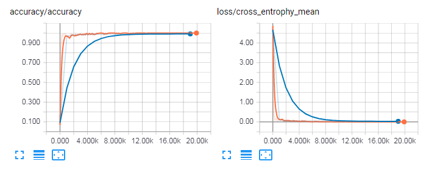
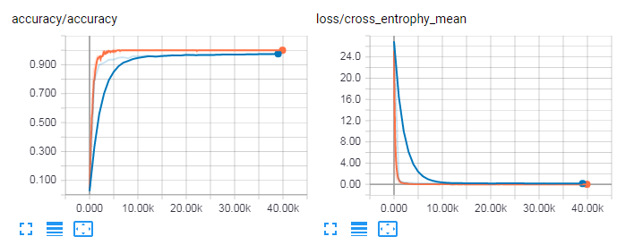
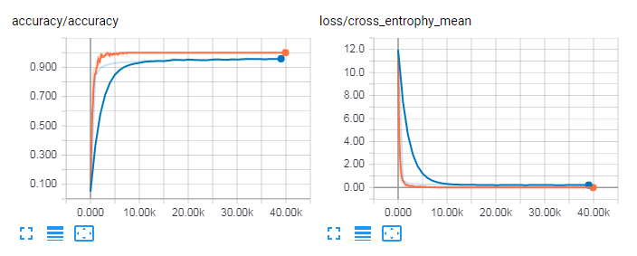

CNN Report
==============

## CNN on MNIST

- Image size: 28x28
- Network architecture:
    ```
    layer  | parameters      | output size
    -------+-----------------+---------
    input  | [?, 32, 32, 1]  |
    conv_1 | [5, 5, 1, 32]   |
    pool_1 | [2, 2]          | [?, 16, 16, 32]
    conv_2 | [5, 5, 32, 64]  |
    pool_2 | [2, 2]          | [?, 8, 8, 64]
    fc     | [4096, 1024]    | 
    dropout| 0.5             |
    output | [1024, 43]      | [43]
    ```
- epoches: 20000
- test accuracy: 99.13%



## CNN on GTSRB

- Image size: 64x64
- Network architecture:
    ```
    layer  | parameters      | output size
    -------+-----------------+---------
    input  | [?, 64, 64, 1]  |
    conv_1 | [5, 5, 1, 32]   |
    pool_1 | [2, 2]          | [?, 64, 64, 32]
    conv_2 | [5, 5, 32, 64]  |
    pool_2 | [2, 2]          | [?, 16, 16, 64]
    conv_3 | [5, 5, 64, 128] |
    pool_3 | [2, 2]          | [?, 8, 8, 128]
    fc     | [8192, 512]     | 
    dropout| 0.5             |
    output | [512, 43]       | [43]
    ```
- epoches: 40000
- test accuracy: 97.54%



## CNN on GTSRB 32x32

- Image size: 32x32
- Network architecture:
    ```
    layer  | parameters      | output size
    -------+-----------------+---------
    input  | [?, 32, 32, 1]  |
    conv_1 | [5, 5, 1, 32]   |
    pool_1 | [2, 2]          | [?, 16, 16, 32]
    conv_2 | [5, 5, 32, 64]  |
    pool_2 | [2, 2]          | [?, 8, 8, 64]
    fc     | [4096, 1024]    | 
    dropout| 0.5             |
    output | [1024, 43]      | [43]
    ```
- epoches: 20000
- test accuracy: 96.06%

