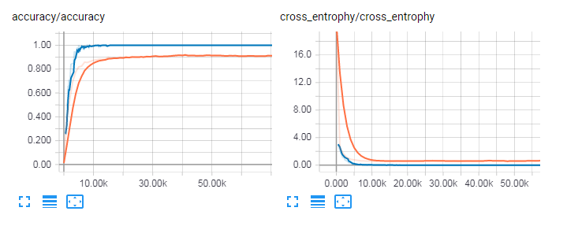
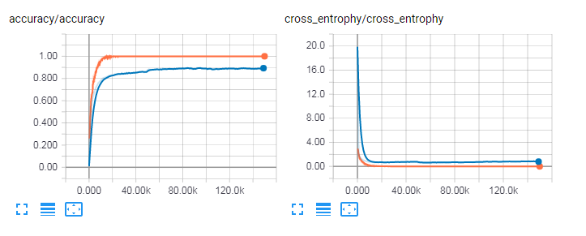

CNN Report
==============

## First try

The first CNN attempt used the following architecture.

```
layer  | parameters      | output size
-------+-----------------+---------
input  | [?, 32, 32, 1]  |
conv_1 | [5, 5, 1, 32]   |
pool_1 | [2, 2]          | [?, 16, 16, 32]
conv_2 | [5, 5, 32, 64]  |
pool_2 | [2, 2]          | [?, 8, 8, 64]
fc     | [4096, 1024]    | 
dropout| 0.5             |
output | [1024, 43]      | [43]
```

Image size was 32x32.
Data was downloaded from [GTSRB](http://benchmark.ini.rub.de/Dataset/GTSRB_Final_Training_Images.zip).

At the beginning random 80% of each image class are used as training set and the other 20% was used as test set. After 140k epoches the accuracy was 98.72%.

## Second Try

Later I realized that the accuracy was biased because of the nature of GTSRB dataset. GTSRB dataset are composed by small images extracted from video captures, and each traffic sign is consisted of 30 images of different resolutions from the same video file. That means all the 30 images are similar. If part of these images are used as training set, the result model will remember all the possible images which makes the accuracy high.

In the 2nd try I decided to use the [official test set](http://benchmark.ini.rub.de/Dataset/GTSRB_Final_Test_Images.zip). The labels can be found [separately](http://benchmark.ini.rub.de/Dataset/GTSRB_Final_Test_GT.zip).

In the 2nd try I used the same architecture as above and achieved only 92% accuracy.

## Third Try

In the third attempt I changed image size to 64x64 and the architecture was as below.

```
layer  | parameters      | output size
-------+-----------------+---------
input  | [?, 64, 64, 1]  |
conv_1 | [5, 5, 1, 32]   |
pool_1 | [2, 2]          | [?, 64, 64, 32]
conv_2 | [5, 5, 32, 64]  |
pool_2 | [2, 2]          | [?, 16, 16, 64]
conv_3 | [5, 5, 64, 128] |
pool_3 | [2, 2]          | [?, 8, 8, 128]
fc     | [8192, 512]     | 
dropout| 0.5             |
output | [512, 43]       | [43]
```

After 200k epoches the final test accuracy was 93.4%.




## Fourth Try

I tried to equalize the histogram of the original image and used the same architecutre as the 3rd try.
Image size was shrinked to 32x32. After 150k epoch the test accuracy was 89.5%.


